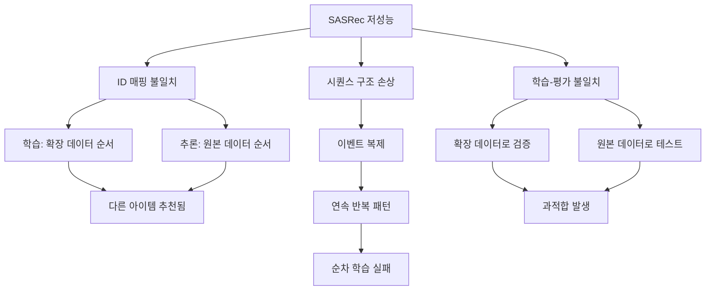

# SASRec 모델 성능 저하 분석 보고서

## 📊 개요

| 항목 | 값 |
|------|-----|
| 작성일 | 2026-02-06 |
| 모델 | SASRec (Self-Attentive Sequential Recommendation) |
| 기대 점수 | NDCG@10: 0.12-0.15 |
| **실제 점수** | **NDCG@10: 0.0843** |
| 베이스라인 | NDCG@10: 0.0955 (ALS) |
| 성능 차이 | -11.7% (베이스라인 대비 하락) |

---

## 🔍 문제 분석

### 1. 핵심 문제: ID 매핑 불일치 (Critical)

> [!CAUTION]
> **가장 심각한 문제**: inference 코드에서 ID 매핑이 학습 시 사용된 매핑과 불일치합니다.

#### 문제 상세

**학습 시 ID 매핑 (recbole_dataset.py):**
```python
# 확장된(expanded) 데이터에서 매핑 생성
train_expanded = train.loc[train.index.repeat(train['repeat_count'])]
user2idx = {v: k for k, v in enumerate(train_df['user_id'].unique())}
item2idx = {v: k for k, v in enumerate(train_df['item_id'].unique())}
```

**추론 시 ID 매핑 (inference_sasrec.py):**
```python
# 원본 데이터에서 별도로 매핑 생성 (불일치!)
train = pd.read_parquet('../data/train.parquet')  # 원본 데이터
idx2user = {k: v for k, v in enumerate(train['user_id'].unique())}  # 순서 다를 수 있음
idx2item = {k: v for k, v in enumerate(train['item_id'].unique())}  # 순서 다를 수 있음
```

#### 영향

- `unique()` 함수의 반환 순서가 데이터 정렬 순서에 따라 달라짐
- 학습 시 확장된 데이터의 순서 ≠ 추론 시 원본 데이터의 순서
- 결과적으로 **아이템 A를 추천하려 했으나 아이템 B를 출력**하는 상황 발생

---

### 2. 시퀀스 구조 손상 (Major)

> [!WARNING]
> SASRec은 순차적 패턴을 학습하는 모델인데, 데이터 복제로 인해 시퀀스가 손상되었습니다.

#### 문제 상세

**원본 시퀀스:**
```
User A: view(item1) → view(item2) → cart(item3) → purchase(item4)
```

**복제 후 시퀀스 (repeat_count 적용):**
```
User A: view(item1) → view(item2) → cart(item3) → cart(item3) → cart(item3) → 
        purchase(item4) → purchase(item4) → purchase(item4) → purchase(item4) → purchase(item4)
```

#### 영향

- SASRec은 **다음 아이템 예측**을 학습하는 모델
- 같은 아이템이 연속으로 반복되면 **"같은 아이템을 다시 추천"**하는 패턴을 학습
- 시퀀스의 자연스러운 흐름이 파괴되어 패턴 학습 불가

---

### 3. 학습-평가 불일치 (Major)

#### 학습 과정 분석

| 항목 | 값 |
|------|-----|
| 학습된 Epoch | 28/30 |
| Validation NDCG@10 | **0.1498** |
| 실제 제출 NDCG@10 | **0.0843** |
| 불일치 정도 | -43.7% |

#### 문제 원인

1. **Validation은 확장된 데이터로 평가**: 복제된 purchase/cart 이벤트가 많아 쉽게 맞출 수 있음
2. **실제 테스트는 원본 패턴**: 자연스러운 사용자 행동 패턴에 대한 평가
3. **결과**: 학습 중에는 좋아 보였지만 실제로는 과적합(overfitting)

---

### 4. ALS vs SASRec 근본적 차이

| 특성 | ALS | SASRec |
|------|-----|--------|
| 모델 유형 | 협업 필터링 | 순차 추천 |
| 가중치 적용 방식 | 명시적 가중치 행렬 | 시퀀스 복제 (부적절) |
| 시퀀스 의존성 | 없음 | **매우 높음** |
| 데이터 복제 영향 | 낮음 | **치명적** |

---

## 📋 근본 원인 요약



---

## 🔧 해결 방안

### 단기 해결책 (즉시 적용 가능)

#### 1. ID 매핑 수정

```python
# inference_sasrec.py 수정
# 저장된 매핑 파일 사용
with open('../data/item2idx.json', 'r') as f:
    item2idx = json.load(f)
idx2item = {v: k for k, v in item2idx.items()}  # 역매핑

with open('../data/user2idx.json', 'r') as f:
    user2idx = json.load(f)
idx2user = {v: k for k, v in user2idx.items()}  # 역매핑
```

#### 2. 데이터 복제 제거

```python
# recbole_dataset.py 수정
# 복제 없이 원본 시퀀스 유지
train_df = train[['user_id','item_id','user_session','event_time']]
# repeat_count 로직 제거
```

### 중기 해결책 (재학습 필요)

1. **원본 시퀀스로 재학습**: 이벤트 복제 없이 자연스러운 시퀀스 유지
2. **손실 함수에 가중치 적용**: RecBole의 sample_weight 기능 활용
3. **하이퍼파라미터 원복**: 베이스라인 설정으로 먼저 테스트

### 장기 해결책 (모델 개선)

1. **Event-Aware SASRec**: 이벤트 타입을 별도 임베딩으로 처리
2. **Weighted BPR Loss**: 커스텀 손실 함수 구현
3. **Multi-Task Learning**: 조회/장바구니/구매 각각 예측

---

## 📊 학습 리소스 낭비 분석

| 항목 | 소요 시간/자원 |
|------|---------------|
| 데이터셋 준비 | 약 3분 |
| 모델 학습 (GPU) | 약 10시간 (28 epochs) |
| 추론 | 약 31분 |
| GPU 사용량 | 5.37GB / 8GB |
| **총 소요 시간** | **약 10.5시간** |
| **결과** | 베이스라인보다 낮은 성능 |

---

## 🎯 교훈 및 권장사항

> [!IMPORTANT]
> 순차 추천 모델에서는 시퀀스 구조를 보존하는 것이 핵심입니다.

### 핵심 교훈

1. **ALS와 SASRec은 다르게 접근해야 함**
   - ALS: 명시적 가중치 행렬 사용 가능
   - SASRec: 시퀀스 구조 유지 필수

2. **ID 매핑은 일관성이 생명**
   - 학습과 추론에서 동일한 매핑 사용
   - 저장된 매핑 파일 재사용

3. **Validation 점수 과신 금지**
   - 데이터 전처리가 검증에도 영향
   - 실제 테스트와 검증 조건이 다를 수 있음

### 다음 단계 권장

1. ID 매핑 버그 수정 후 기존 모델로 재추론
2. 원본 시퀀스로 새로운 데이터셋 생성
3. 베이스라인 하이퍼파라미터로 재학습
4. 이벤트 가중치는 손실 함수에서 처리

---

## 📎 참고 자료

- [SASRec 논문](https://arxiv.org/abs/1808.09781): Self-Attentive Sequential Recommendation
- [RecBole 문서](https://recbole.io/docs/): 순차 모델 가이드
- 프로젝트 코드: `c:\Users\user\Downloads\Recsys\code\`

---

*보고서 작성: 2026-02-06*
*버전: 1.0*
