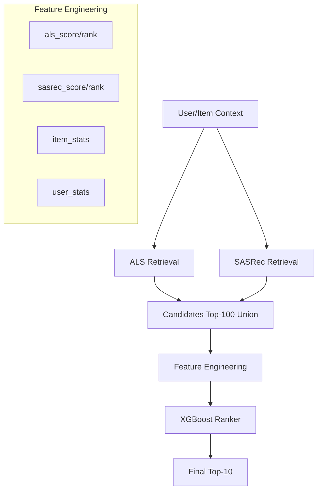

# [Strategy Pivot] Learning-to-Rank (LTR)를 통한 실전적 앙상블

## 1. 현황 분석 및 한계
- **최고 점수 (0.1196):** ALS + SASRec + XGBoost의 단순 순위 가중치 합산으로 달성.
- **실패 사례 (EASE, RRF):** 
    - EASE는 노이즈가 너무 많아 가중치를 줄수록 성능이 하락함.
    - RRF는 모델 간의 성능 격차가 클 때 우수한 모델(ALS)의 신호를 희석시킴.
- **핵심 문제:** "어떤 유저에게 어떤 모델이 더 잘 맞는지"를 판단하는 로직이 부재함.

## 2. 근본적 대안: LTR (Learning-to-Rank)
추천 시스템의 산업 표준인 **2-Stage Retrieval-Ranking** 구조로 전환합니다.

### 구조도

### 핵심 전략
1.  **Model as Experts:** ALS와 SASRec을 아이템 공급자이자 '피처 생성기'로 활용합니다.
2.  **Score-based Features:** 순위(Rank)뿐만 아니라 모델이 내뱉은 확신도(Score)를 피처에 포함하여 정보 손실을 최소화합니다.
3.  **Direct Optimization:** NDCG를 직접 최적화하는 `XGBRanker`를 사용하여 랭킹 품질을 극대화합니다.

## 3. 실행 로드맵
- **1단계 (Data):** Top-100 후보군 생성 및 모델 스코어 결합 (`generate_ltr_data.py`).
- **2단계 (Model):** 유저 그룹별 랭킹 최적화 학습 (`train_ltr.py`).
- **3단계 (Inference):** 최종 10개 추출 및 제출 (`output_ltr_final.csv`).
